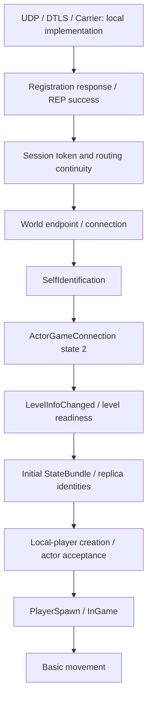

# Handshake and player-spawn reconstruction map

Current continuation: [structural reduction and exact experiments](HANDSHAKE_SPRINT2_PROGRESS.md). This map records the first checkpoint; that report supersedes its remaining serialization gaps.

Updated 2026-10-04. Branch: `work/gpt61-handshake-sprint`. Baseline: `435153d`.

**Player spawn on the preservation server is not achieved.** The existing transport implementation and new structural codecs are tested locally. No retail-client world-entry success is claimed. This map records the finite remaining requirements, rather than treating a captured login replay as a working server.

## Evidence meanings

VERIFIED means directly supported by the identified executable, preserved bytes, or a reproducible local check; the scope is stated alongside the claim. INFERRED means a candidate interpretation. COMMUNITY-REPORTED means an external account without local proof. COMMUNITY-CORROBORATED means an external interpretation agrees with local evidence. CONFLICTING means the sources disagree. A verified serializer is not verified server acceptance.

## Connection chain

The executable's GameConnectionWorkflow states are A WaitingForREPConnection, B WaitingForActorGameConnection, C WaitingForSpawnPoint, D WaitingForPlayerSpawn, E InGame. These are client gates, not a complete list of wire messages. SpawnPoint is an empty reflected marker; its name does not establish position data or player creation.

## Closed structural requirements

| Requirement | Evidence and result | Scope |
|---|---|---|
| REP-01 incoming response identity | VERIFIED: writer `146B6F190` requests descriptor provider `1407F2E80`, compares incoming virtual `+30` descriptor through `146158BA0`; the provider maps to RegistrationResponseMsg UUID `104145A7-FF95-44F1-9468-21FB41C8AC2B`. Equality compares descriptor address or identity words `+18/+20`. | Identifies the accepted class, not sufficient session values. Compact type 3 is COMMUNITY-CORROBORATED. |
| REP-02 response field structure | VERIFIED: unmarshal `1407CD040` reads BE u32 error, raw8 identity, prefix string token, prefix string server version, four booleans. Writer requires first-response gate `+600` and zero error, applies fields, then sets REP `+601`. | Minimum legal token, identity, flags and subsequent connection behavior remain open. |
| WIRE-PREFIX | VERIFIED encoder `140877970`, decoder `14087B5C0`: prefix-width uint32, not LEB128. Widths 1/2/3/4/5; marker bits 0/10/110/1110/11110; low 7/6/5/4/3 bits in first byte, remaining value bytes LE, decode modulo 32 bits. | New dedicated codec. Existing Carrier VLQ is not globally replaced. |
| WIRE-ROUTING | VERIFIED `1461455F0`: flags then optional raw8 A (bit0) and raw8 B (bit1). `1417B2430`: presence byte then reflected identity. Type zero introduces raw16 inline identity. Extended bit2 structure is unsupported and rejected. | All 177 preserved messages match type and size. First StateBundle has flags 3 and type offset18. These two raw8 fields are not identified as a UUID. |
| WIRE-WRITE | COMMUNITY-CORROBORATED: outgoing dump prefix is CRC32 BE4, length BE4, raw16 correlation, routed message. All 37 unredacted outgoing CRCs match CRC32 over bytes from offset8. | Captured plaintext convention; not automatic proof for every transport layer. |
| SELF-SCHEMA | VERIFIED `1414FD530`: TaggedName; three ObjectReferences each BE u32 + raw16 + raw16; nested BE u32, prefix-count BE u32 array, two strict booleans, BE float64; final TaggedName. TaggedName flags bit0 selects raw16 identity, otherwise prefix string bytes. | Preserved self-ID body12702 bytes fully consumed and roundtrips all known bytes; array3136 elements. Two redacted identity spans remain unknown. Semantic names are deliberately neutral. |
| SPAWN-MARKER | VERIFIED `1414E3930` consumes no body. Preserved type `0x651` message is four header bytes. | SpawnPoint is a marker, not coordinates. |
| LEVEL-PREFIX | VERIFIED `1415009E0`: two prefix strings, two BE float64, raw8 then collection/context decoder `1415B3370`. | Collection elements and semantic constraints remain open. Complete structural codec and both capture roundtrips now verified; see sprint2 report. |

New code: `server/newworld_server/protocol/{prefix_uint32,reflected,routing,framing,self_identification}.py`. Registration version strings now use the evidenced prefix-width length, including lengths >=128. Stream framing handles partial and concatenated frames, truncation and bounded allocation. These codecs are available for evidenced integration; this checkpoint does not emit speculative post-registration messages.

## Client gates and remaining dependency graph

| Node | Required behavior / dependencies | Evidence searched and candidate interpretation | Why it blocks | Minimum resolving observation |
|---|---|---|---|---|
| REP-03 | Valid server-generated response identity, session token and flags; depends on REP-01/02 | Existing registration encoder, writer `146B6F190`, response schema, redacted successful login. INFERRED token is connection continuity material; required flags/minimal values are not proved. | Structurally valid response may still fail downstream association. | Authorized preservation-server registration test with its own fresh session values, showing REP `+601` and the next connection action; record accept/reject and server transcript. |
| WORLD-ENDPOINT | Select and open preservation world connection after REP; depends on REP-03 | Existing endpoint/GCW reports, untracked LIVE-05 consumers, LIVE-06D stack/image provenance. Candidate endpoints/consumers do not establish assignment provenance. | No verified endpoint/session wiring for independent world handoff. | Observation of endpoint assignment and subsequent connect in a permitted local test, with destination and session correlation, without unrelated credentials. |
| ACTOR-LINK | Associate SelfIdentification references with ActorGameConnection; depends on world connection and SELF-SCHEMA | Handler `146454C00` -> `145A87010`, Actor `+A0=2` -> `145A92370`. Redacted SelfIdentification and reference reader `1415ACC30`; structural body verified. INFERRED references correlate replica/player identities. | Arbitrary identities/3136 arbitrary integers cannot establish a legitimate local actor. | Paired self-ID and associated actor/replica messages from one permitted session, with consistent replacement identifiers or observations of resolved reference objects. |
| LEVEL-CONTEXT | Construct accepted level state; depends on actor link | Handler `146446800` -> `145A9FA00`, Actor `+BC8=1` -> `145A905C0`; reader `1415009E0`, context `1415B3370`, collection `1415BB350`; captured110-byte LevelInfo. Two strings and two f64 verified; collection elements/context still not fully mapped. | Prefix serialization alone does not satisfy level/resource readiness. | Complete bounded schemas for called collection readers, then local test documenting resource lookup/readiness outcomes for locally available world data. |
| SB-INIT | Initial replica/state bundle establishes required objects; depends on session, actor and level identity continuity | Existing StateBundle archaeology, first captured46423-byte bundle, 16 extra routing bytes now explained. Candidate bundle contains identities and initial state; body layout and minimum object set not solved. | Client cannot materialize required world/player objects from an opaque captured bundle. | Bounded decode of initial bundle sections tied to known type registry and the identities referenced by SelfIdentification; a permitted session observation of object creation/lookup success. |
| SB-MASTER | Establish state ownership/order and updates; depends on SB-INIT | Existing bundle/GCW reports and subsequent captured bundles. INFERRED ownership and ordering govern accepted replicated state, not proved minimum sequence. | A single initial bundle does not demonstrate ongoing coherent replicated state. | Correlated initial and next state update with object identities, ordering/ownership values and observed application acceptance. |
| SPAWN-01 | Reach local-player creation/actor acceptance; depends on actor, level, SB-INIT/master | Actor `+252` writer `142FFBC50`, accept `1434B0940`, match `1434985C0`, earlier causal reports. Candidate identity match / replica creation is incomplete. | Workflow D cannot finish from empty SpawnPoint alone. | Trace or bounded schema evidence linking incoming replica/player construction to the accepted actor and `+252` transition in a permitted local session. |
| SPAWN-02 | Satisfy workflow D->E; depends on SPAWN-01 | Existing GCW closure: `141026080` returns nonnull and returned object's virtual `+30` yields nonnull. No sampled LIVE-06D player anchor. INFERRED these are local-player/object readiness checks. | InGame requires usable client objects in addition to wire markers. | Observe both readiness results and D->E during the same preservation-session test; identify missing object/resource if either is null. |
| MOVEMENT | Encode/apply basic movement; depends on verified InGame and SB-MASTER | Existing movement/provider reports and plaintext timeline; no verified preservation-player position progression. | Message-shaped values without a spawned actor cannot demonstrate movement. | One local spawned-player input and resulting state update, correlated to actor identity and observed position change. |
| TEST-ENV | Permit controlled retail-client-to-preservation testing | SSH sandbox intentionally has a separate network namespace; loopback tests pass, host services cannot be exposed from this sandbox automatically. | Unit tests cannot verify actual client world entry. | Administrator-managed isolated listening endpoint for the preservation service and a user-authorized legitimate client test. No extra account privilege is required for research. |

This graph is finite: REP-03 -> WORLD-ENDPOINT -> ACTOR-LINK -> LEVEL-CONTEXT + SB-INIT -> SB-MASTER -> SPAWN-01 -> SPAWN-02 -> MOVEMENT. TEST-ENV gates live verification. Structural requirements above are closed; the remaining nodes must not be represented as solved by replaying community bytes.

## Capture coverage and conflicts

LIVE-03 PCAP has encrypted DTLS1.2/C030 traffic; it does not supply plaintext world-entry state. Its SHA256 is `5adf04c3534876a0b79456f80cde3ecc2448e017210076fcb5c813ab14dc199d`.

LIVE-06D event CSV has114378 rows but blank event_values throughout. Raw ETL examination recovered NewWorld image load: runtime base `0x7ff6398c0000`, image size183214080 and checksum179232167, matching local PE metadata. No captured executable hash proves exact build identity. Executable VA = runtime address - runtime base + `0x140000000`. All226278 stack samples have depth32, so absent deeper anchors are inconclusive. One sample contains REP materializer return `146B6EC64` and framed parser callback return `146AE4663`; this supports the call path, not the payload. One GCW driver sample contains `14644A66F`. No SelfIdentification/LevelInfo/player gate was recovered from these sampled stacks.

Local executable SHA256: `8654f01d324636d9f74f1c793b0cc4a417c3c5fa9847d9913c358ca29e0fdc8e`. Type UUID providers are verified executable identities; sparse compact type indices remain community-correlated. SelfIdentification is `0x65c`, UUID `169443E0-A508-4653-B437-49B7A195F69C`; `0x5d1` is CharacterServiceProxyActor, superseding older self-ID guesses.

CONFLICTING: community self-ID decoder interpreting a count of5, a signing trailer and fixed padding records contradicts the evidenced3136-element BE u32 vector. CONFLICTING: community LevelInfo LE u32 string lengths and four float32 interpretations contradict prefix string readers and two float64 readers. These interpretations are excluded from implementation.

Artifacts: `reports/handshake-sprint/capture-framing-audit.tsv`, `capture-coverage-summary.json`, `self-identification-capture-validation.json`, `live06d-image-provenance.json`, `live06d-stack-correlation.json`, `live06d-target-stack-hits.tsv`, and bounded `disasm/` excerpts. Audit scripts emit metadata only. Raw proprietary bodies and redacted-placeholder identity values are not new fixtures or replay inputs.

## Validation and next stage

Run from `server`: `.venv/bin/python -m pytest -q`. This checkpoint: **102 passed**. Tests use synthetic data and cover prefix width boundaries, fragmented frames, lengths, routing, inline identity, self-ID structure and malformed input. Preserved capture validation is a separate read-only check, not a retail-client acceptance test.

The planned second sprint is human-readable current-retail-client dependency/compatibility analysis: EAC/EOS, Steam, Amazon services, launch context, authentication, endpoint selection, certificate/trust and other dependencies, with references, purpose, startup/menu/connect/world-entry/InGame requirements, absence behavior and evidence status. It is deferred pending instruction. Start from least-invasive configuration/compatibility possibilities. Security-mechanism circumvention or modification is outside this handshake sprint. No Amazon production service experiments were performed in this checkpoint.
